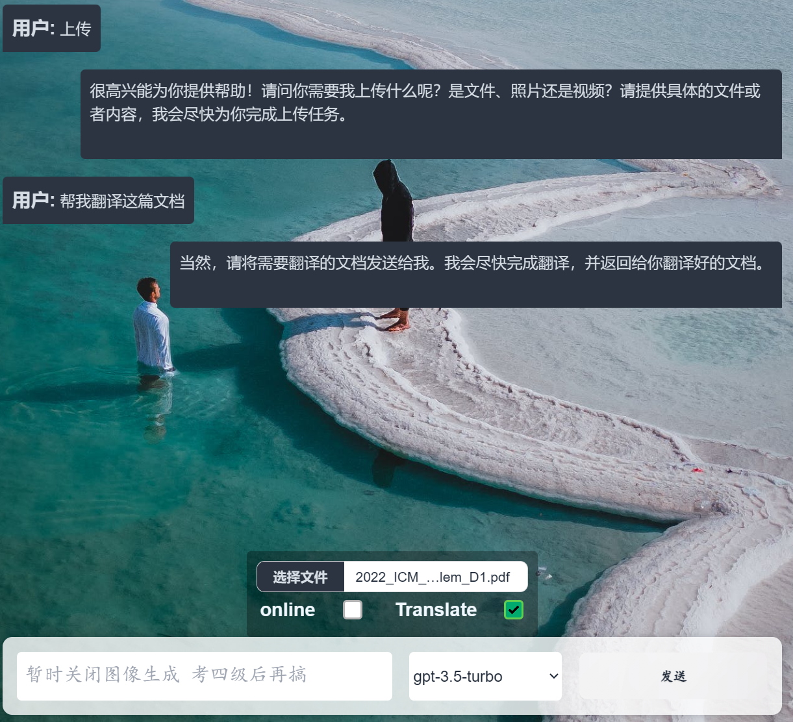
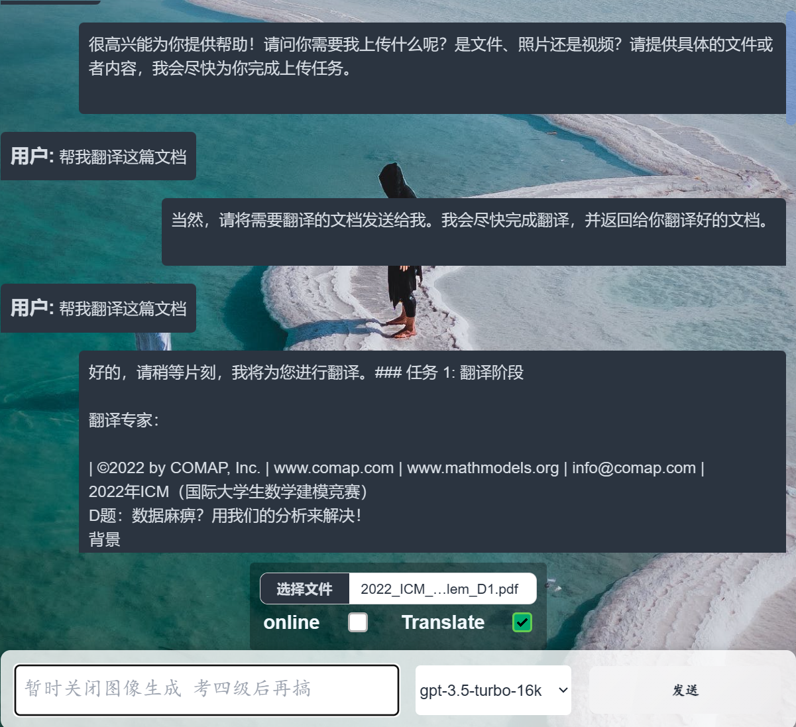
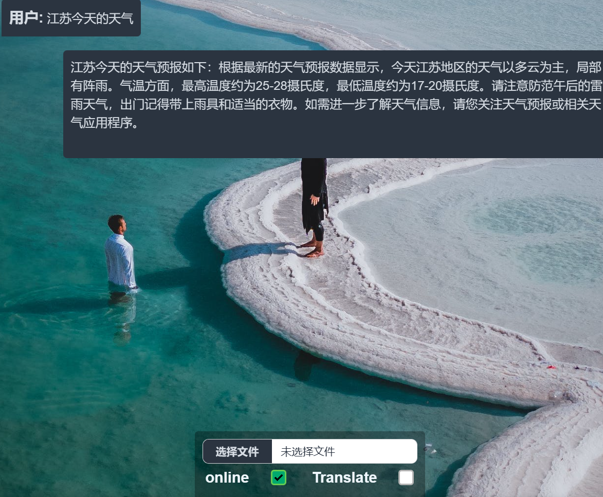
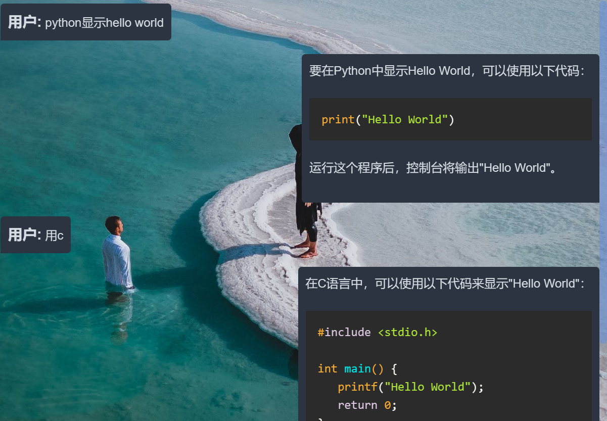
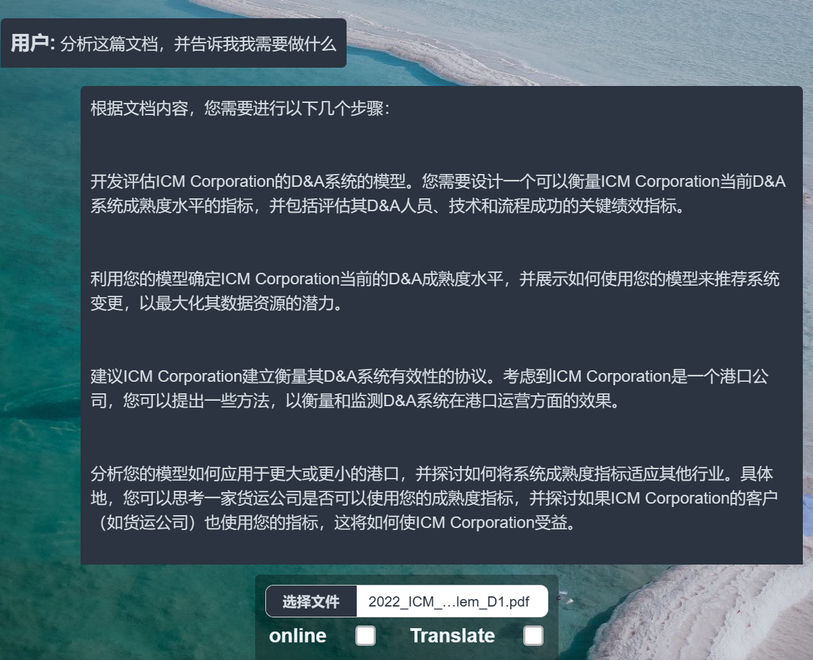
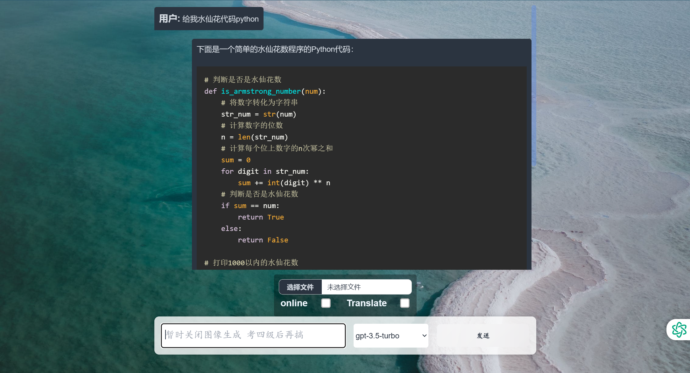
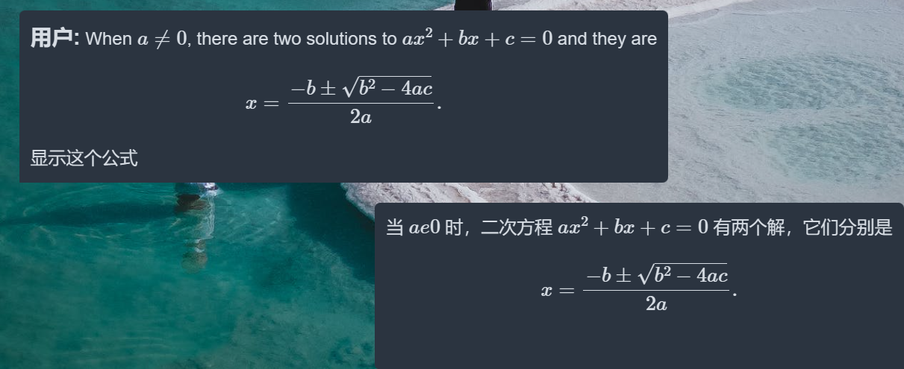

# 💎 OpenAI_WLH ✨


欢迎来到 **openai_wlh**，这是一个独特的项目，使你能在博客上展现个性化的 ChatGPT 功能。它不仅操作简单，还可以轻松地在你的服务器上进行部署。

## 🌟 特别功能

1. 🌍 [利用prompt专业翻译](https://www.bilibili.com/read/cv28100058/?jump_opus=1)：详细比对其他翻译方法
2. 📄 **自制部署pdf识别内容**
   - 支持对pdf文件提问，需要更大的模型时，如从 18k 升级至 36k，可解决上下文限制问题，我们将持续进行改进。
   - 
   - 使用gpt-3.5-turbo-16k模型进行翻译：
     - 
3. 🌐 **联网功能online**
   - 
4. 🗣 **上下文对话**
   - 
5. 📤 **pdf上传**
   - 
6. 💻 **代码公式显示**
   - 
   - 

## 😊 已有模型

以下是我们的模型列表：

1. **gpt-3.5-turbo**: 用于文本生成、问题回答和对话生成。
2. **gpt-3.5-turbo-16k**: GPT-3.5 Turbo 的 16k 变体。
3. **gpt-4**: 更智能、更强大，提升了对上下文的理解和生成自然语言的能力，适用于多种复杂的NLP任务。
4. **gpt-4-1106-preview**: GPT-4 模型的 1106 预览版本。
5. **gpt-4-32k**: GPT-4 模型的 32k 变体。
6. **code-llama-34b**: 34亿参数的 Code Llama 模型。
7. **code-llama-13b**: 13亿参数的 Code Llama 模型。
8. **llama-2-70b**: 70亿参数的 Llama 2 模型。
9. **llama-2-13b**: 13亿参数的 Llama 2 模型。

-------------------**以上模型均可联网**-------------------

## 🚀 快速上手

1. **免费获取 API**
   - 通过第三方 OpenAI API，费用仅为 OpenAI 官方标价的 0.2 倍（不同模型价格不同，但已经低于官网价格）。
   - 无需繁琐的外网信用卡或银行卡认证，简单快捷。
2. **获取你的 API 密钥**
   - 在 [GODGPT](https://gptgod.online/#/register?invite_code=1m3granfgvvffu4kflueotdiv) 获取你的 API 密钥。
   - 密钥嵌入项目的详细操作方法将提供，无需担心。
3. **流式输出**
   - 完成配置后即可使用。
4. **数据库**
   - 未完成。
5. **后端**
   - 使用 Flask

## 🌐 项目体验

立刻 [体验 W-GPT](http://8.138.104.244)，项目正在阿里云上运行，稳定可靠。

## 🛠️ 软件架构

详尽的软件架构说明，让你更深入了解项目的构建和设计。帮我美化一下这段 markdown 文件，添加部署标题，内容如下：

## 🚀 项目部署

【Flask项目部署（阿里云服务器Ubantu操作系统）】

```sh
https://www.bilibili.com/video/BV1kX4y1N7u9?vd_source=86128f0caacbd1f48d8ba64b076f5197
```

在 git 上运行以下命令进行项目克隆：

```sh
git clone https://gitee.com/developer-father/openai_wlh.git
```

然后在 openai_wlh 目录运行以下命令安装所需依赖：

```sh
pip install -r requirements.txt
```

最后，在 shell 中运行 openai_flask.py 文件，指定端口号（默认为 5000）：

```sh
python openai_flask.py
```

---

**我知道这个网站还有很多漏洞，包括apikey保护，网站稳定性，美观性，后端可视化... 可能现在的我还无法完成，但是我会努力的去做好这个项目，因为：**

可能没有很多人会在意这个无比小的项目，但是她会，那我也会继续努力更新迭代下去，这也是我做这个项目的初衷


