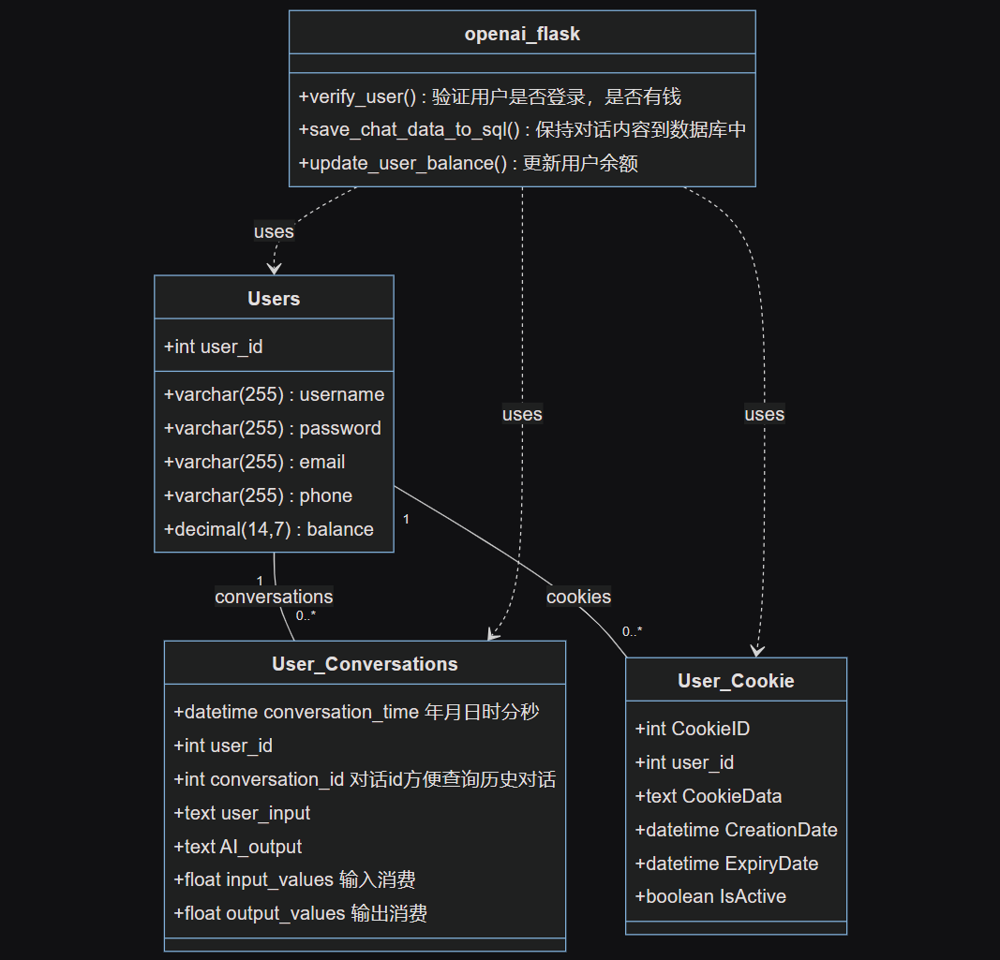
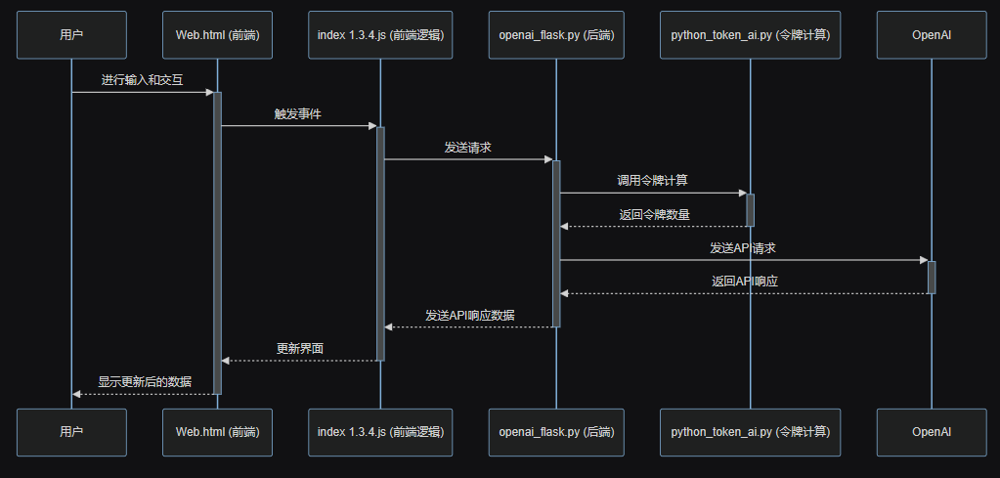

# WGPT项目介绍

## 项目概述

WGPT（Web-based GPT）是一个综合性的网页应用，旨在通过集成多种GPT模型，为用户提供全面的办公、学习和数据分析解决方案。该项目不仅包括多样化的GPT模型应用，还计划纳入GLM4模型，以提高语言处理的效率和准确性。

## 数据库关系图和部分字段解释



## 后端与前端工作流程图



## 已完成的功能

- **登录系统**：提供安全且方便的用户登录功能。
- **页面背景颜色调节**：允许用户根据个人喜好自定义页面背景颜色。
- **上下文管理**：有效处理和存储用户交互上下文。
- **文档传输**：支持在用户和系统间安全地传输文档。
- **GPTs API调用**：集成了多种第三方GPT模型API。
- **模型选择功能**：用户可根据需求选择不同的AI模型。
- **自动登录**：利用cookie实现便捷的自动登录功能。
- **后端安全控制**：实现用户权限和IP白名单管理。
- **实时更新用户余额**：动态显示用户的账户余额。

## 部署指南

### 创建数据库

1. 创建名为`wgpt`的数据库，并在`init_sql.py`中配置数据库用户名和密码。

### 获取源代码

```sh
git clone https://github.com/wlhtea/wlh_gpt.git
```

## 初始化

数据库

```sh
python init_sql.py
```

## 安装依赖

```sh
pip install -r requirements.txt
```

## 启动后台

```sh
python openai_flask.py
```

## 本地运行

访问web.html即可在本地运行项目。

## 服务器部署

- 修改index 1.3.4.js中的URL地址，并确保服务器的5000端口已开放。

## GLM4与GPT3.5的对比及使用原因

## GLM4的优势

- **响应速度**：GLM4提供更快的响应速度。
- **成本效益**：GLM4的费用相对较低，为0.1/1k token。
- **长文本支持**：支持128k上下文的长文本处理。

## GLM4的劣势

- **API文件传输限制**：目前仅支持JSON文件传输。
- **并发数量限制**：每时每刻最多5个并发请求。
- **数据库内容陈旧**：截至2021年，数据库内容相对陈旧。

## 使用GLM4的原因

- **成本效益**：GLM4为性价比较高的选择，特别是在处理非文档链接相关的任务时。
- **响应速度**：更快的响应时间，使得用户体验更为流畅。

## GPT3.5的优势

- **稳定性**：GPT3.5在处理文档链接和其他复杂内容方面表现更为稳定。
- **功能多样性**：适合处理多种类型的请求，包括链接内容获取和文档分析。

### 使用GPT3.5的原因

- **功能全面**：尽管成本略高，但GPT3.5在处理需要网络连接的内容和复杂文档时更加有效。
- **兼容性**：GPT3.5能够更好地适应各种复杂的用户需求。

## 未来规划

- **纳入GLM4模型**：提高语言处理的效率，同时降低运行成本。
- **增加用户注册和历史对话记录功能**：提升用户体验和功能完善性。
- **扩展页面功能**：如支持更丰富的文件上传类型，提高系统的灵活性和用户的便利性。
- **优化后端以支持OpenAI API**：为了更好地适应市场变化和技术进步，计划优化后端支持OpenAI的API。
